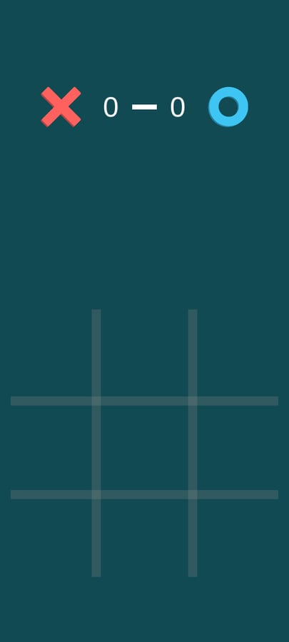
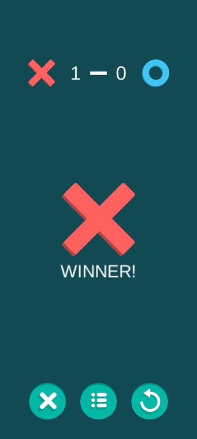

# Tic-Tac-Toe

I developed this game while leanrning the Minimax algorithm.  
I also decided to explore the developing for Android with Unity.

##Features
- 3 levels of difficulty:
    - Easy: Bot chooses random
    - Medium: 50/50 chance the bot chooses random or Minimax
    - Hard: Bot uses Minimac algorithm to play
- Scoreboard
- The player can choose if it goes first(X) or second(O).

